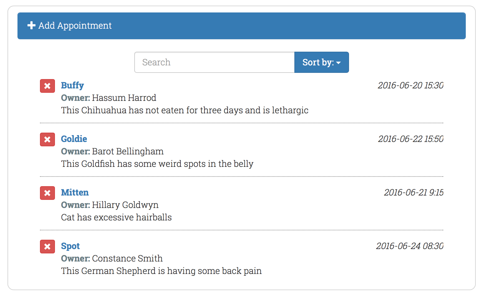

# React v.15 - Booking App

## Overview

An app to book an appointment for a pet to visit a vet, from the Lynda.com course [Building a Web Interface with React.js](https://www.lynda.com/React-js-tutorials/Building-Web-Interface-React-js/495271-2.html), but starting from the FountainJS [fountain-react](http://fountainjs.io/doc) generator.



##  Usage

### Get the code

clone repo @ your-folder-of-choice

```bash
git clone https://github.com/smerth/react-15-booking-app-fountainjs.git
```
### Install dependancies

```bash
npm install
```
### Run server

```bash
node server.js
```
